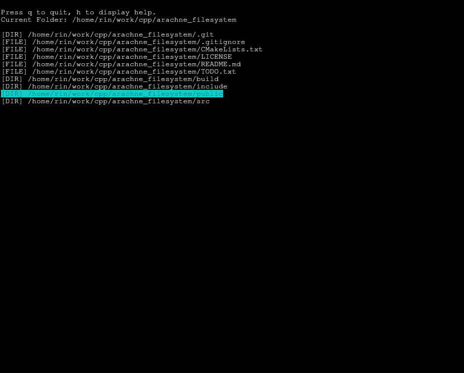

# arachne_filesystem
A TUI file explorer using std::filesystem and ncurses



## Requirements

- GCC 12 or newer to support C++20 features.

## Controls

- Enter key: open folder
- Backspace: go to parent directory
- Key Up and Key Down: browse directory / browse current file
- h: display help
- o: toggle file viewer
- l: toggle directory viewer
- r: rename selected file / folder. Leave the field empty and press Enter to cancel renaming.
- s: file status: display selected entry size (in KB or MB), permissions and modified time.
- c: create file
- f: create directory
- d: remove file / folder
- p: copy file / folder
- m: move file / folder
- q: quit program

## Quick setup for testing

```bash
git clone https://github.com/theflyoccultist/arachne_filesystem.git
mkdir build && cd build
cmake ..
make
./arachne_filesystem
```

## Installation

```bash
sudo cmake --install build
```
